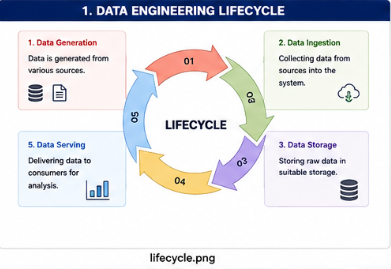
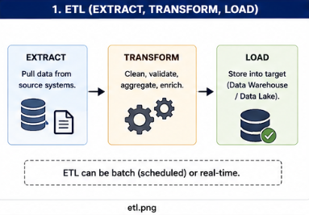
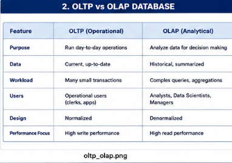
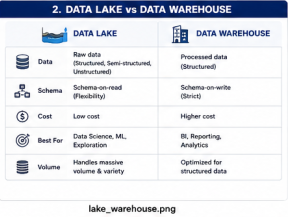
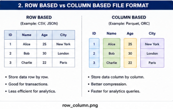
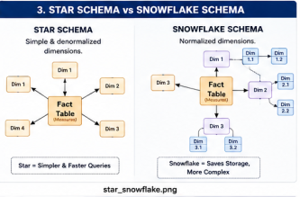
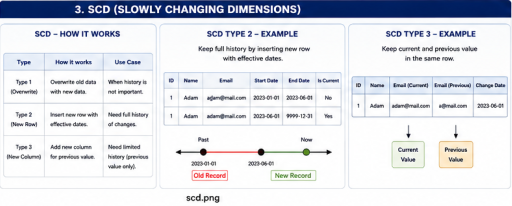
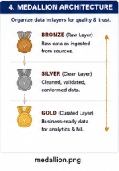
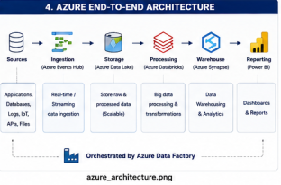

# Data Engineering Fundamentals - Comprehensive Notes

## 1. Data Lifecycle & Core Concepts

* **Data Lifecycle:** The end-to-end flow of data encompassing Generation, Ingestion, Storage, Transformation, and Serving.
* 

* **ETL (Extract, Transform, Load):** The pipeline process of pulling data from source systems, cleaning/enriching it, and storing it into a target system (Batch or Real-time).
* 

## 2. Databases & Storage Architectures

* **OLTP vs. OLAP:** Operational databases (OLTP) optimized for fast writes vs. Analytical databases (OLAP) optimized for complex reads.
* 

* **Data Lake vs Data Warehouse:** Flexible, schema-on-read raw storage vs. structured, schema-on-write processed storage.
* 

* **File Formats:** Row-Based (e.g., CSV, JSON) for transactions vs. Column-Based (e.g., Parquet, ORC) for efficient analytics querying.
* 

## 3. Data Modeling

* **Star Schema vs Snowflake Schema:** Simple, denormalized dimensions (Star) vs. normalized, storage-saving dimensions (Snowflake).
* 

* **Slowly Changing Dimensions (SCD):** Strategies for handling historical data changes over time (Type 1 Overwrite, Type 2 New Row, Type 3 New Column).
* 

## 4. Cloud Data Engineering & Architectures

* **Medallion Architecture:** Organizing data into logical layers for quality and trust: Bronze (Raw), Silver (Clean), and Gold (Curated).
* 

* **Azure End-To-End Architecture:** A complete cloud data pipeline orchestration using Azure Event Hubs, Data Lake, Databricks, and Synapse.
* 

